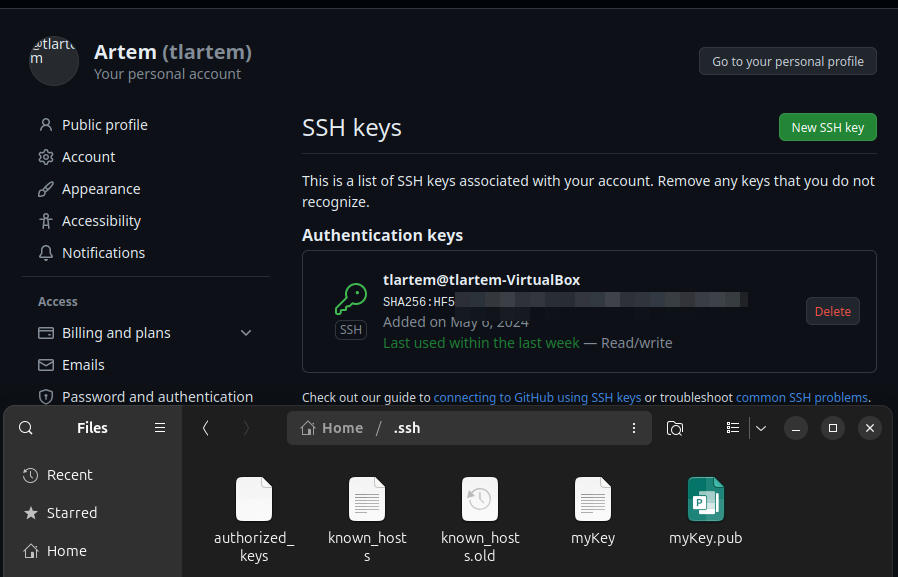
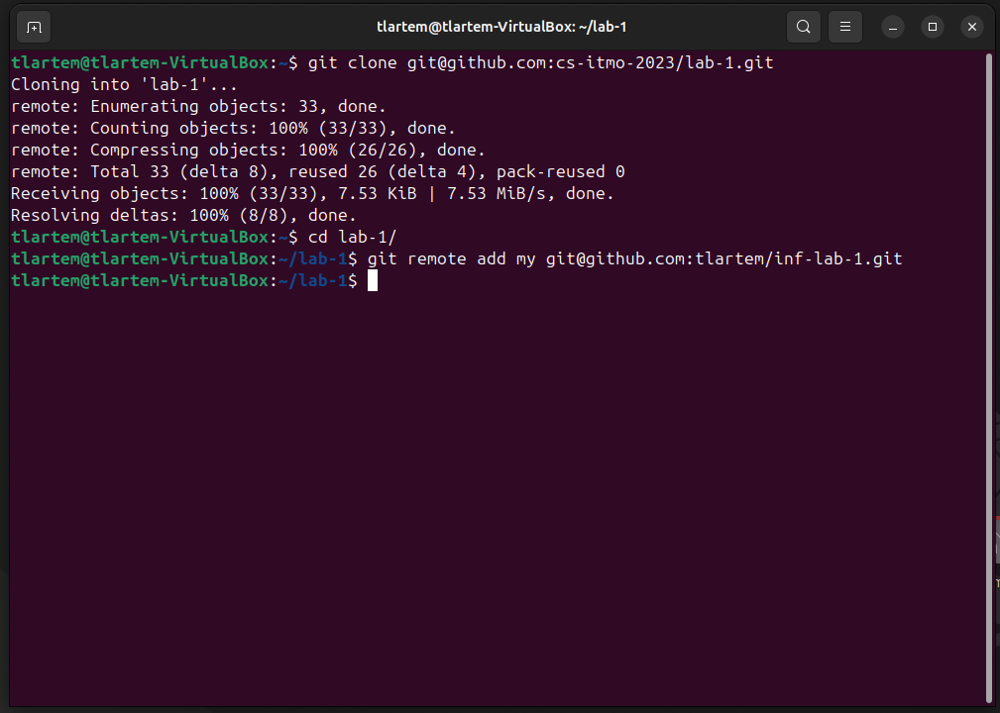
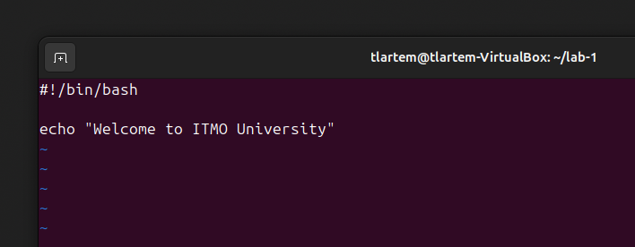
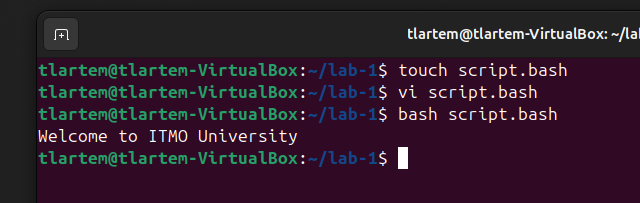
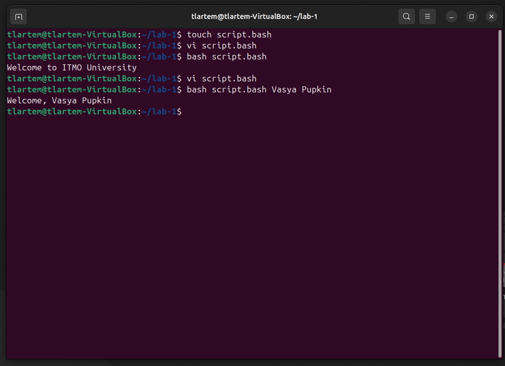

# Ознакомление с терминалом Linux и Git

## Цель:
Ознакомиться с терминалом Linux, научиться работать с командной строкой и использовать Git для контроля версий.

## Задачи:
- Установить и настроить SSH-ключи.
- Клонировать репозиторий с лабораторной работой.
- Создать и выполнить bash-скрипт.
- Модифицировать скрипт для персонализированного приветствия.

## Основная часть
SSH ключи были сгенерированы и затем добавлены на GitHub.


Далее был сохранен удаленный репозиторий лабораторной работы и добавлено подключение к собственному репозиторию.



В основной директории был создан Bash скрипт с требуемым содержанием. Позже он был исполнен в терминале.





Далее содержание файла изменено на:
```bash
#!/bin/bash
echo "Welcome, $1 $2"
```


## Вывод

Вывод
В ходе лабораторной работы были изучены основы работы с Linux через терминал, освоены навыки работы с командной строкой, настройки SSH-ключей, а также выполнения и модификации bash-скриптов.


